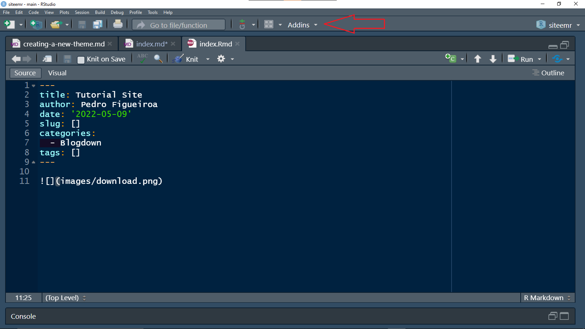
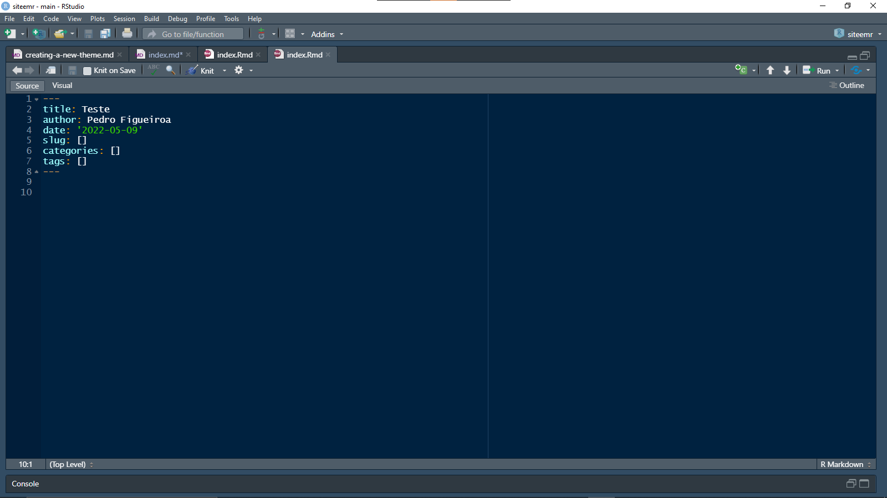
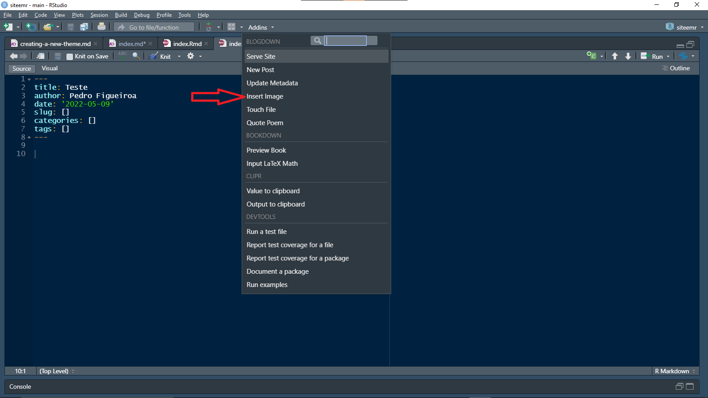

Pessoal, vou explicar para vocês como criar novos post no blogdown do R.

Em primeiro lugar você vai no seu R Studio e clique em "Addins"

Agora vai abrir um caixa para você colocar o Título do post, o Autor, a data em que o post está sendo escrito, você pode adicionar Tags entre outros
Nesse tutorial só vou alterar o Título 

Importante marcar R Markdown (.Rmd), ele vai dispor de mais funcionalidades para o post

Pronto agora é só digitar aqui no R o que você quiser que o conteúdo será feito

Caso queira colcoar uma imagem é só ir novamente em "Addin"s e selecionar "Insert Image".

Feito Isso você salva o site no disquete acima e agora faremos o processo de commit.
Na parte superior direita vai em Git

Agora vamos em Commit

E vai abrir essa tela

Nessa caixinha você vai selecionar as mudanças que você fez no site e marcá-las 

Após selecionadas as mudanças tente fazer aos poucos, para não travar muito
Digite a mensagem para commit, a mensagem que você digitar, você vai conseguir ver lá no github
E depois clique em commit

E depois clique em push

